## 实验一：安装配置一个私有云
*17343101 苏祺达*
<br />

### 实验目的
---
* 初步了解虚拟化技术，理解云计算的相关概念
* 理解系统工程师面临的困境
* 理解自动化安装、管理（DevOps）在云应用中的重要性

### 实验环境
---
&emsp;&emsp;实验需要硬件虚拟化（AMD-V 或 Intel-VT）支持，部分旧笔记本不支持。

### 实验要求
---
* 用户通过互联网，使用微软远程桌面，远程访问你在PC机上创建的虚拟机
* 虚拟机操作系统 Centos，Ubuntu，或 你喜欢的 Linux 发行版，能使用 NAT 访问外网。

### 实验过程
---
#### 在 Virtual Box 上配置虚拟网卡，用于和虚拟机进行通信  
&emsp;&emsp;如图，在 Virtual Box 启动界面选择”工具“选项右边的的菜单按钮，选择”网络“，点击“创建“，Virtual Box 会生成一张虚拟网卡，取消“DHCP 服务器“的“启用”选项，以便过后静态配置虚拟机的 IP，并设置该虚拟网卡的的 IPv4 地址为 192.168.100.1/24，点击“应用”以应用该网卡设置。  
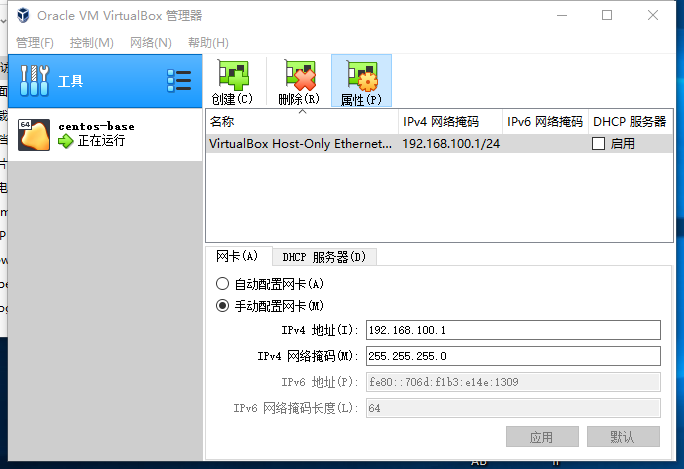  
&emsp;&emsp;创建完网卡后，在宿主机上使用`ipconfig`命令，可以看见创建的虚拟网卡的配置信息
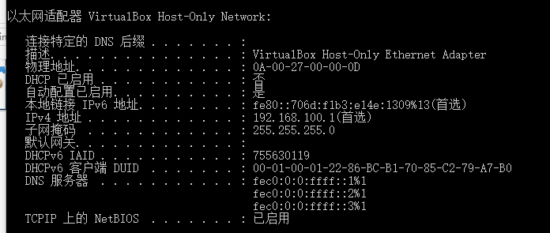  
<br />

#### 在 Virtual Box 上创建 CentOS 虚拟机  
&emsp;&emsp;在顶部菜单栏选择“控制”-“新建”选项，在弹出的界面中为虚拟机选择名字、存储位置，系统类型选择“Linux”，版本这里应该选择“Red Hat（64-bit）“的，因为 CentOS 相当于 Red Hat 的一个发行版，但是选择了“Other Linux（64-bit）“也没有什么问题。  
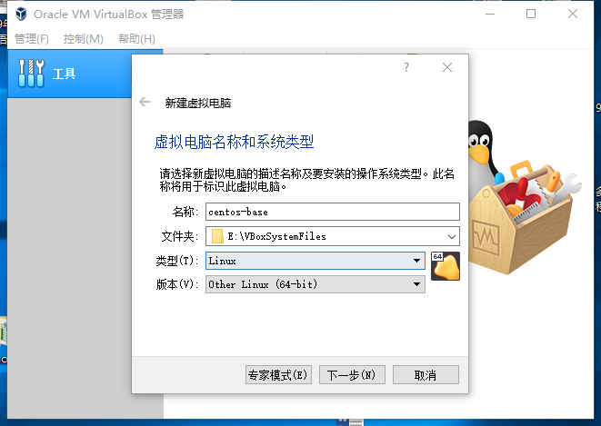  
&emsp;&emsp;给虚拟机分配内存，这里内存的大小可以根据需要自行决定，因为电脑上常年有些吃内存的程序在运行，所以只分配了 2G 的内存给这台虚拟机。  
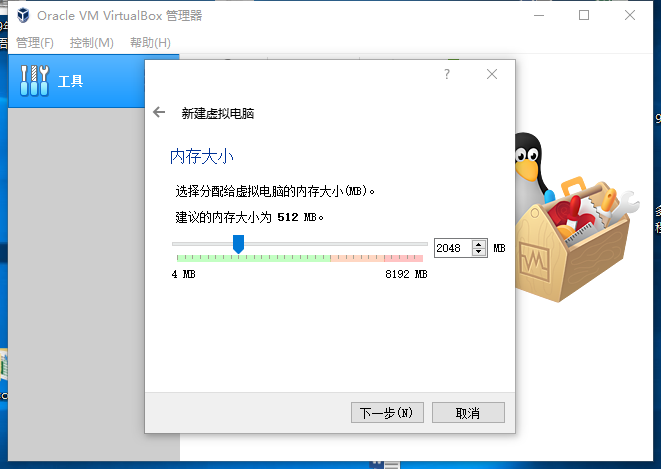  
&emsp;&emsp;创建虚拟硬盘，并选择虚拟硬盘的类型、位置和容量，在类型选择这里理论上三种类型的虚拟硬盘都可以，但笔者曾经遇见过其他两种硬盘出错的状况，所以选择了第一种“VDI（Virtual Box 磁盘映像）“。至于磁盘空间分配方式，一般选择“动态分配”以节约宿主机空间。  
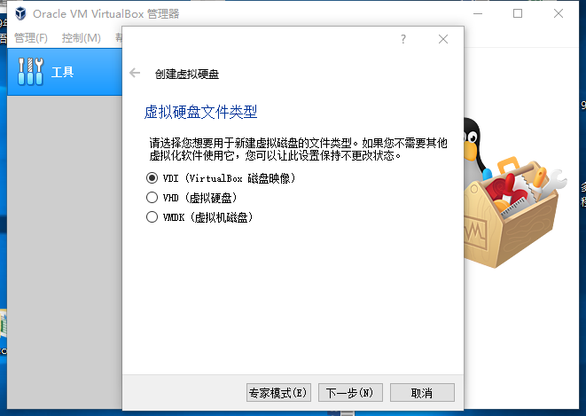  
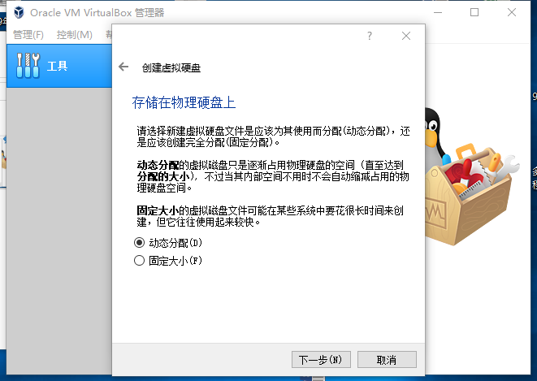  
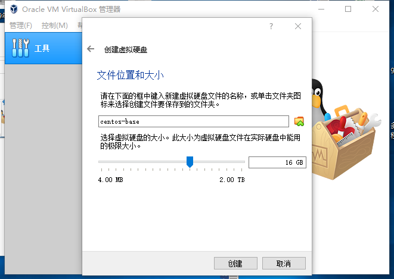  
&emsp;&emsp;右键点击刚刚创建的虚拟机，选择“设置”-“网络”，为虚拟机创建网卡。第一张网卡连接方式为“网络地址转换（NAT）”，该模式下将会为虚拟机自动分配一个 IP 地址，外部对虚拟机的访问会通过宿主机的端口转发到该虚拟机上，但该模式下无法建立从宿主机到虚拟机的连接，也无法进行虚拟机与虚拟机之间的连接，因此要为虚拟机创建第二张虚拟网卡，用于宿主机与虚拟机之间的通信。选择该网卡的连接方式为”仅主机（Host-Only）网络“，界面名称为第一步中创建的宿主机网卡。  
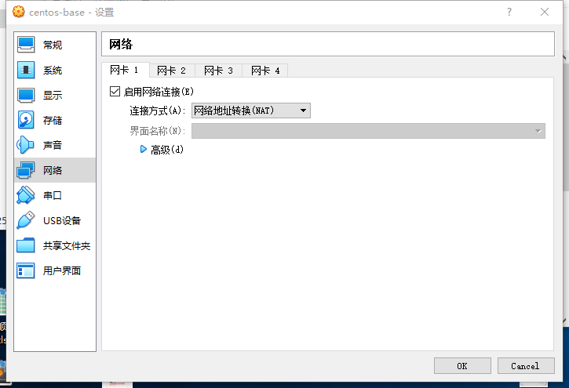  
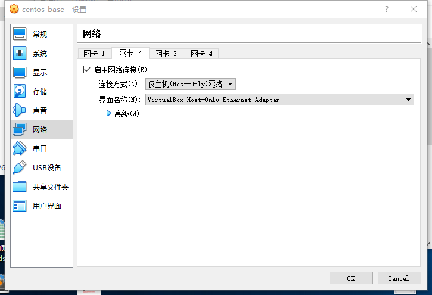  
&emsp;&emsp;在打开的设置界面中选择“存储”，继续为虚拟机选择磁盘映像，CentOS 的磁盘映像可以通过[阿里云的镜像站](http://mirrors.aliyun.com/centos/7.6.1810/isos/x86_64/)下载，选择 Minimal 版本的光盘镜像下载就可以了。在存储界面选择“IDE 控制器”下的光盘图标，在右边的属性栏中有一个“分配光驱”选项，该选项的右边是一个光盘图标，点击该图标，选择“选择一个虚拟光盘文件”，选择刚刚下载的光盘镜像文件。  
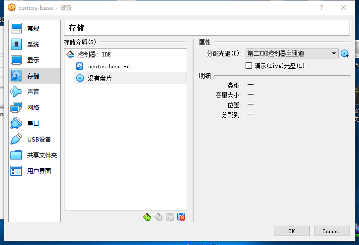  
&emsp;&emsp;点击右下方的“OK”以保存选项。双击创建的虚拟机启动虚拟机，等待片刻后出现安装菜单，选择“Install CentOS 7”。  
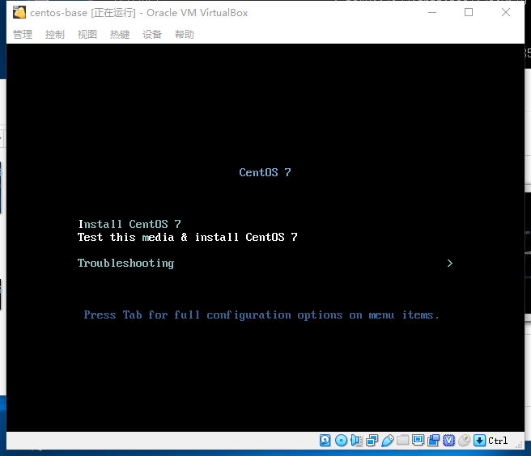  
&emsp;&emsp;随后出现语言选择菜单，因为之前的操作系统版本选择错误的问题，这里会看不到鼠标，只能用 TAB 键切换到下面的搜索框搜索到“中文”，再使用 TAB 键切换“中文”选项，然后切换到“继续”按钮，按回车选择继续。  
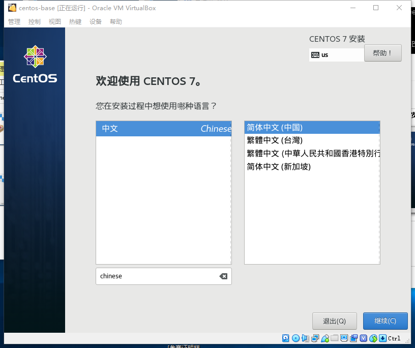  
&emsp;&emsp;接下去会出现“安装信息摘要“界面，一开始会有很多选项不可用，需静等片刻，直到只剩下一个选项为灰色的时候，再使用 TAB 键切换到“安装位置”，按回车进入，进去以后什么都不用做，按回车直接退出来就行了，接下去“开始安装”按钮就可以选中了，再使用 TAB 键（祺达大失败……）切换到这个按钮，就可以继续了。  
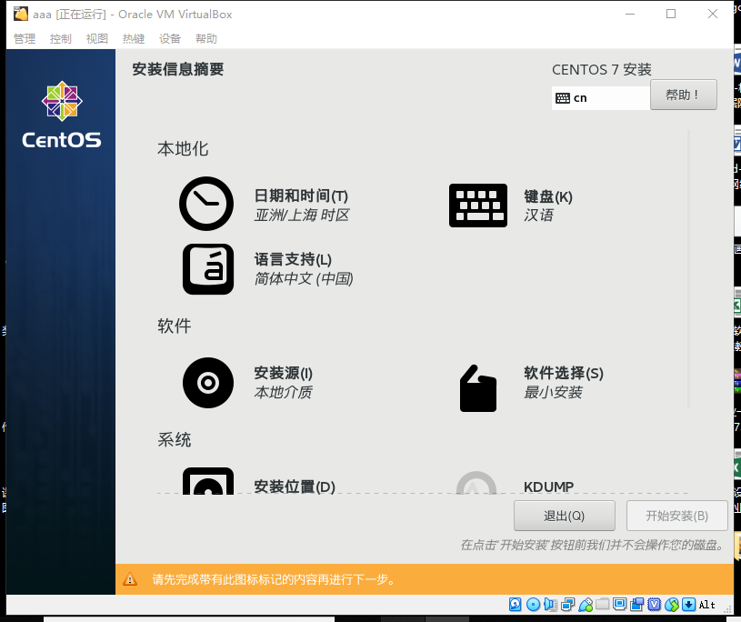  
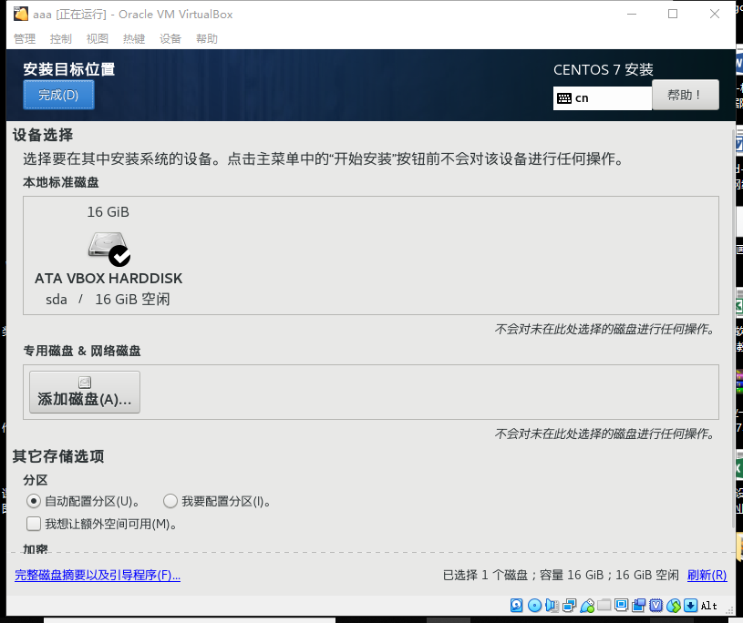  
&emsp;&emsp;接下去是安装的等待界面，在等待的过程中创建个人账户并给 root 账户设置密码。  
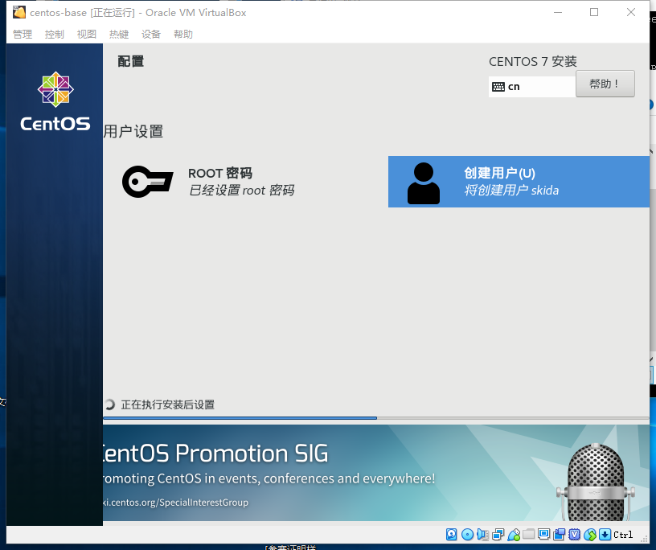  
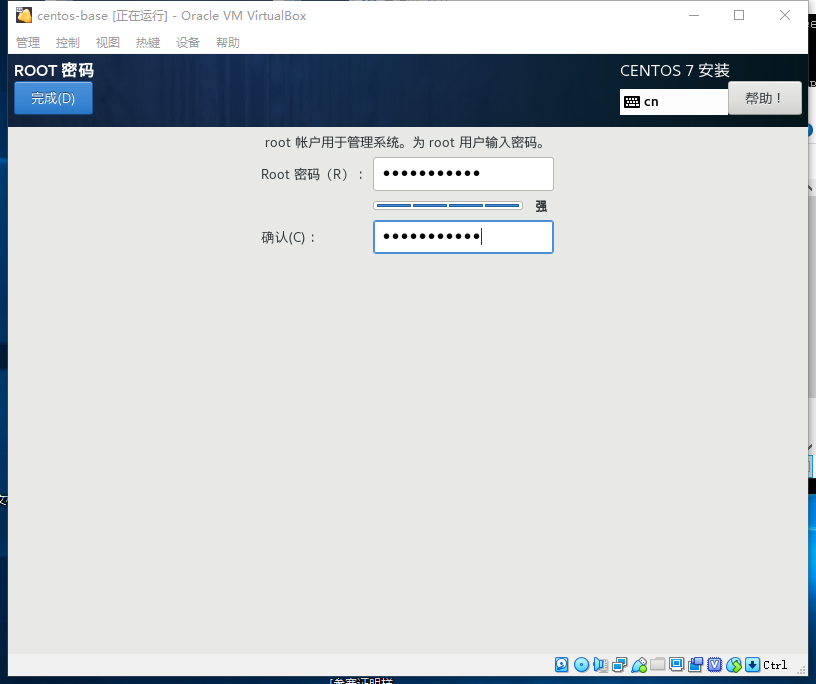  
&emsp;&emsp;安装完毕重启虚拟机，选择第一个选项进入系统。  
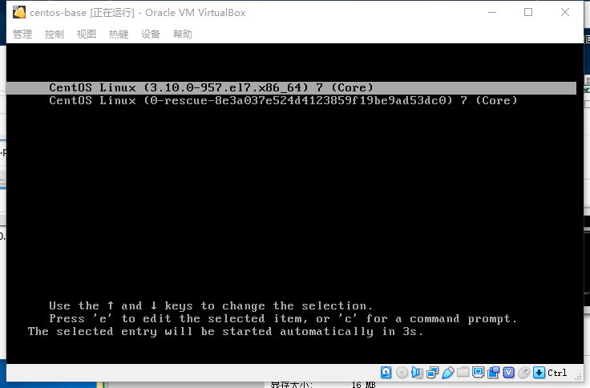  
&emsp;&emsp;因为接下去要进行网络配置，很多地方要使用到 root 权限，因此使用 root 权限登录。  
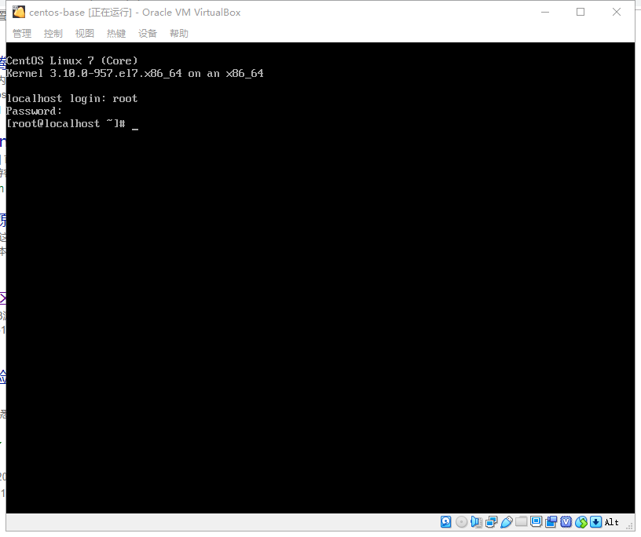  
&emsp;&emsp;该系统可以使用 root 用户正常登录，至此，虚拟机安装完毕。  
<br />

#### 配置虚拟机网络，使虚拟机可以访问外网且主机与虚拟机之间可以相互通信  
&emsp;&emsp;使用`nmcli con show`命令，记下两张网卡的名字和 UUID，第一张网卡为连接外网用的网卡，第二张网卡为连接主机的网卡。  
&emsp;&emsp;使用`ifconfig`命令，记下两张网卡的 MAC 地址， MAC 地址为网卡名称对应的`ETHER`字段。  
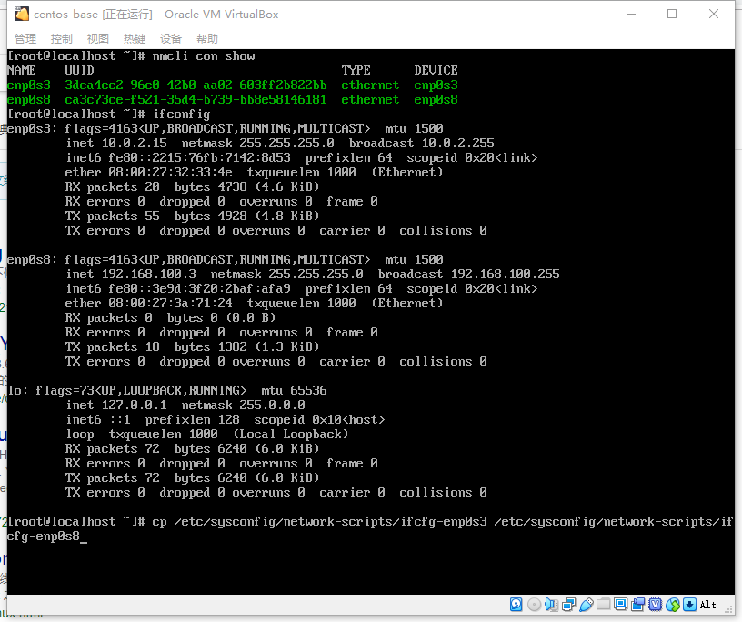  
&emsp;&emsp;使用`cp /etc/sysconfig/network-scripts/ifcfg-enp0s3 /etc/sysconfig/network-scripts/ifcfg-enp0s8`命令，复制第一张网卡的配置文件，这里的`enp0s3`、`enp0s8`分别为第一张网卡和第二张网卡的名称。  
&emsp;&emsp;使用`vi /etc/sysconfig/network-scripts/ifcfg-enp0s8`命令，配置第二张网卡，修改其中的5个字段：
1. `BOOTPROTO`字段，修改为`static`；
1. `NAME`字段，修改为`enp0s8`；
1. `DEVICE`字段，修改为`enp0s8`；
1. `ONBOOT`字段，修改为`yes`；
1. `UUID`字段，修改为前一步记录下的第二张网卡的 UUID。  

&emsp;&emsp;并添加4个字段：  
1. `IPADDR`字段，其值为`192.168.100.3`（即这台虚拟机的地址，不可设置为`192.168.100.2`，会引发地址冲突）；
1. `NETMASK`字段，其值为`255.255.255.0`；
1. `GATEWAY`字段，其值为`192.168.100.1`（即地址是第一步中宿主机虚拟网卡的地址，此时这张网卡起到了网关的作用）；
1. `HWADDR`字段，其值为前一步记录下的第二张网卡的 MAC 地址。

&emsp;&emsp;如图：  
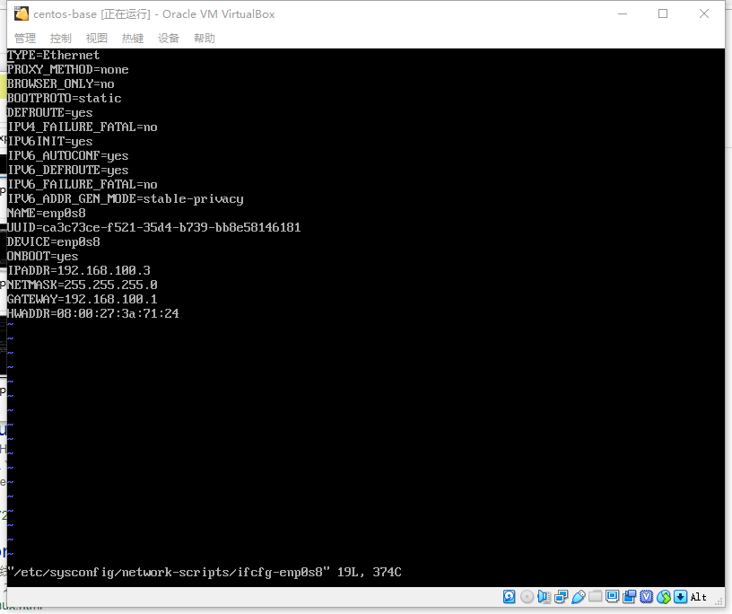  
&emsp;&emsp;使用`vi /etc/sysconfig/network-scripts/ifcfg-enp0s3`命令，配置第一张网卡，修改里面的`ONBOOT`字段为`yes`，并添加`HWADDR`字段，其值为前部记录下的第一张网卡的 MAC 地址。  
&emsp;&emsp;如图：  
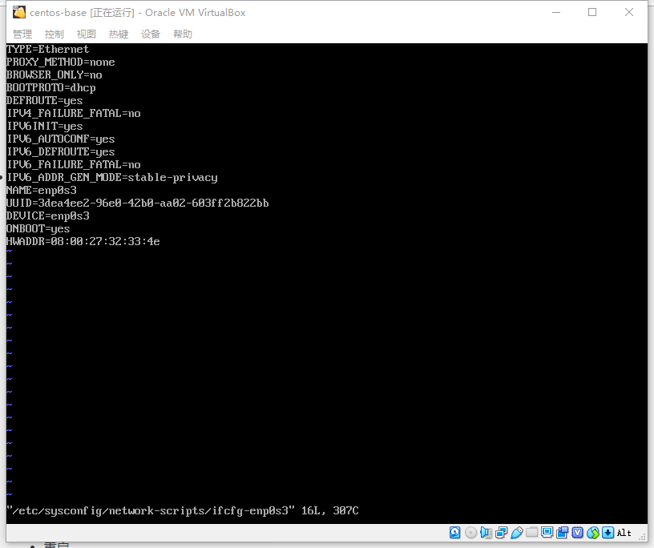  
&emsp;&emsp;使用`shutdown -r 0`命令，立刻重启虚拟机。继续使用 root 用户登录。  
&emsp;&emsp;使用`vi /etc/resolv.conf`命令，配置全局 DNS 服务器。第一个 DNS 服务器的地址是第一步中宿主机虚拟网卡的地址。  
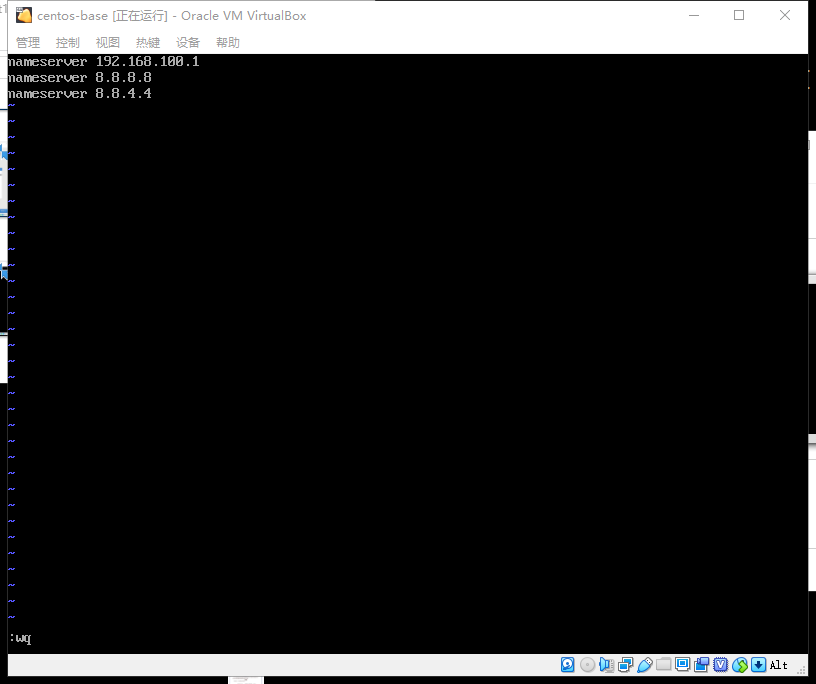  
&emsp;&emsp;经过这几步配置，该虚拟机可以连接外网并正确解析域名了，ping 一下`mirror.centos.org`试试：  
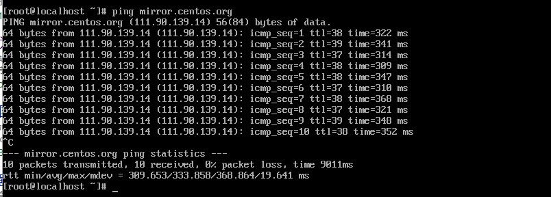  
&emsp;&emsp;于是使用`yum update`升级内核，并使用`yum install`安装 wget、vim、gcc、gcc-c++、gdb 等常用的工具。  
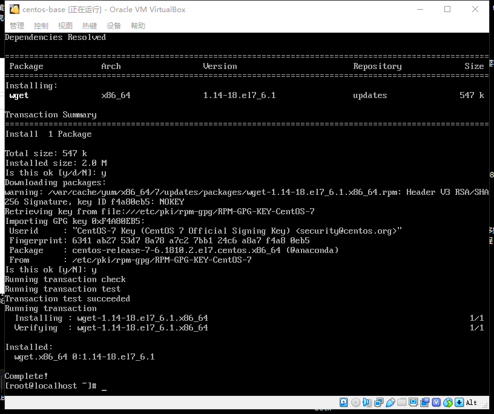  
&emsp;&emsp;由于这个系统内部已经安装了openssh-server，于是可以直接使用`systemctl start sshd`启动 ssh 服务，并使用`ss -antp | grep sshd`查看服务是否正在监听 22 端口。  
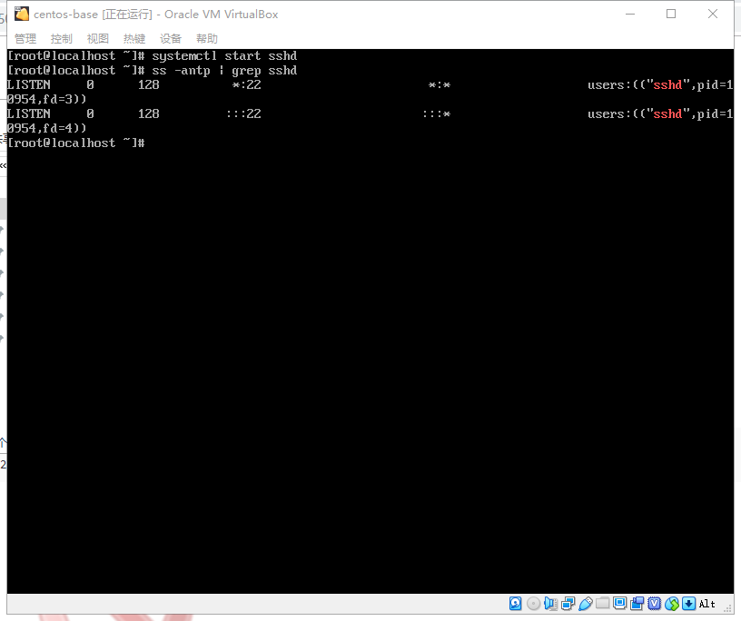  
&emsp;&emsp;此时就可以通过宿主机 ssh 连接到虚拟机了，第一次连接会显示一个警告，询问是否接受来自该地址的公钥：  
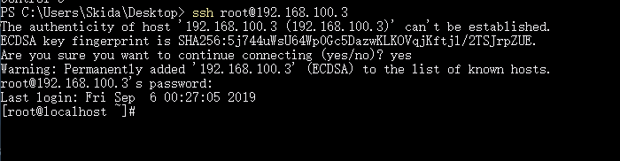  
&emsp;&emsp;至此，网络配置已经全部完成。  
<br />

#### 配置并连接虚拟桌面  
&emsp;&emsp;使用`yum group install "GNOME Desktop"`指令安装桌面，再使用`startx`指令启动桌面，就可以看到久违的 GUI 了：  
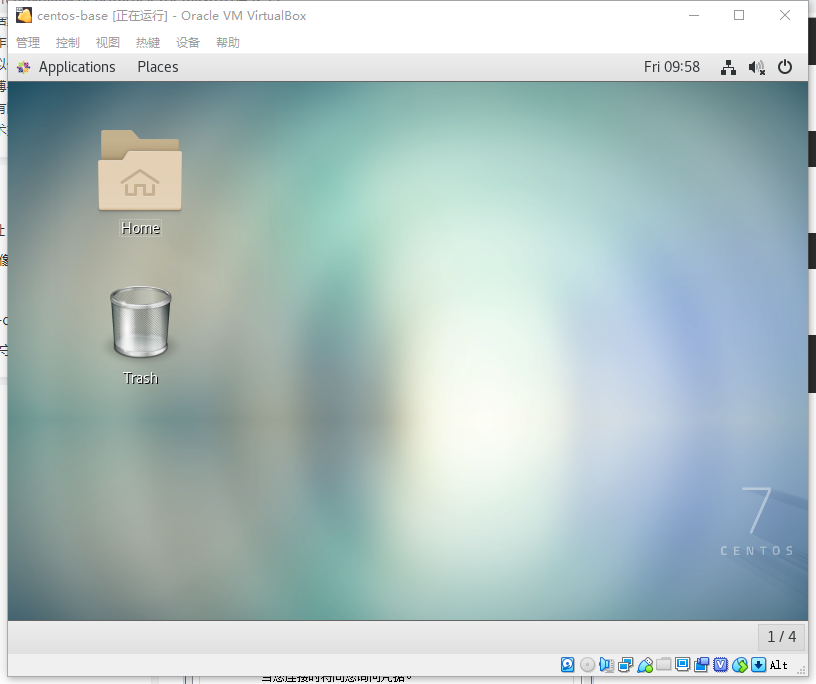  
&emsp;&emsp;选择顶部的“Applications“-“Favorites“-”Terminal“，打开命令行界面，执行`yum install epel*`安装 EPEL 源，然后执行`yum --enablerepo=epel install xrdp`安装远程桌面服务器，但安装过程中遇到了如下问题：  
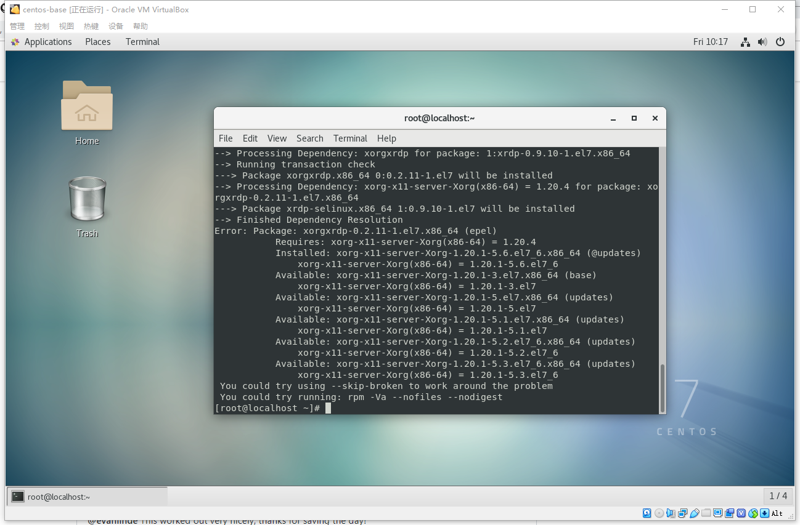  
&emsp;&emsp;在xrdp的仓库下找到了相关[issue](https://github.com/neutrinolabs/xrdp/issues/1119)，是因为 xorg 针对 CentOS 的版本更新总是延后一段时间造成的，该 issue 中也提到了解决方案，于是到[https://apps.fedoraproject.org/packages/xorgxrdp/builds](https://apps.fedoraproject.org/packages/xorgxrdp/builds)找到依赖 xorg-x11-server-Xorg(x86-64) 的版本低于 1.20.1-5.6 的最新的 xorgxrdp 版本为 xorgxrdp-0.2.7-3.fc29，于是执行`wget https://kojipkgs.fedoraproject.org/packages/xorgxrdp/0.2.7/3.fc29/x86_64/xorgxrdp-0.2.7-3.fc29.x86_64.rpm`下载该版本安装包，并使用`yum install xorgxrdp-0.2.7-3.fc29.x86_64.rpm`进行手动安装，安装完毕后再执行`yum install --enablerepo=epel xrdp`就可以继续安装了。  
&emsp;&emsp;安装完毕后使用`systemctl start xrdp`启动 xrdp 服务，并使用`ss -antp | grep xrdp`查看该服务正在监听的端口。  
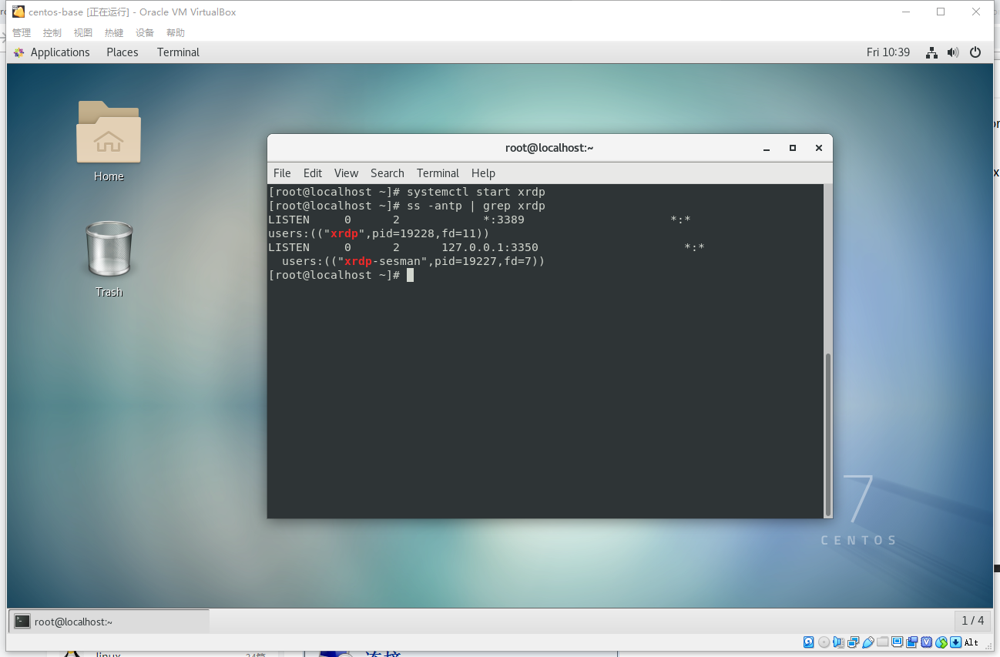  
&emsp;&emsp;在宿主机上使用远程桌面连接虚拟机，但连接失败了：  
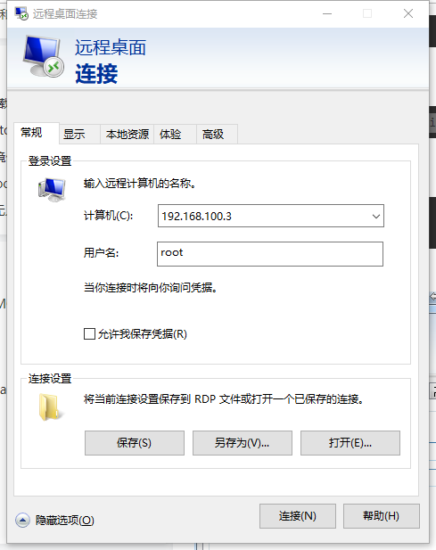  
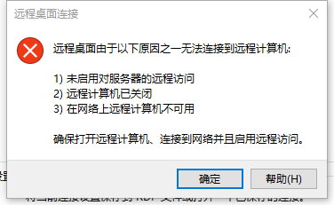  
&emsp;&emsp;到虚拟机上使用`vi /var/log/messsages`查看错误信息，看到文件最后几行有如下信息：  
  
&emsp;&emsp;猜想是因为防火墙没有放通3389端口导致的，于是执行如下指令放通3389端口和3350端口：  
```shell
firewall-cmd --zone=public --add-port=3389/tcp --permanent
firewall-cmd --zone=public --add-port=3350/tcp --permanent
firewall-cmd --reload
systemctl restart firewalld
```
  
&emsp;&emsp;然后就可以在宿主机上通过远程桌面访问虚拟机了。  
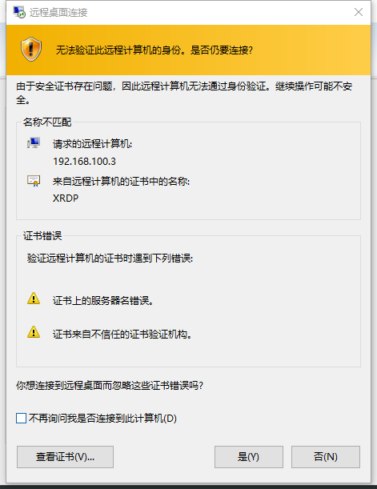  
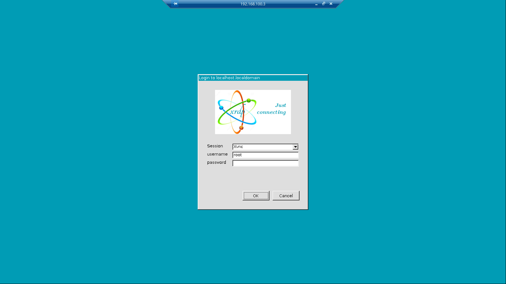
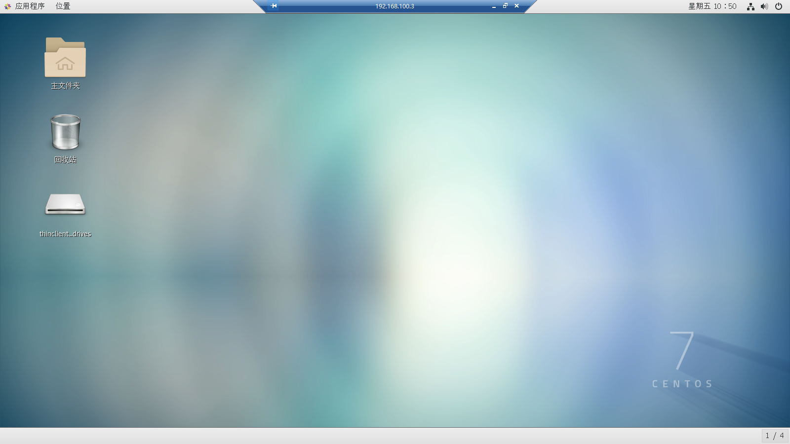
&emsp;&emsp;要使用远程主机访问该虚拟机的远程桌面，只需要在虚拟机的第一张网卡界面，选择“高级”-“端口转发”，将主机上的空闲端口转发到虚拟机上的3389端口就行了。  