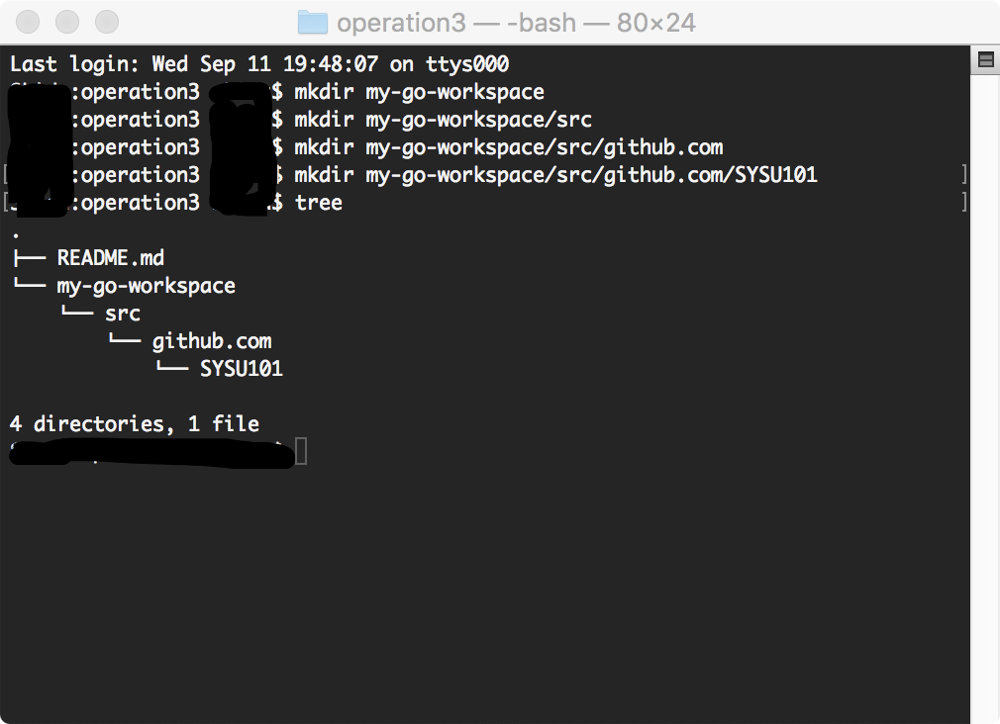
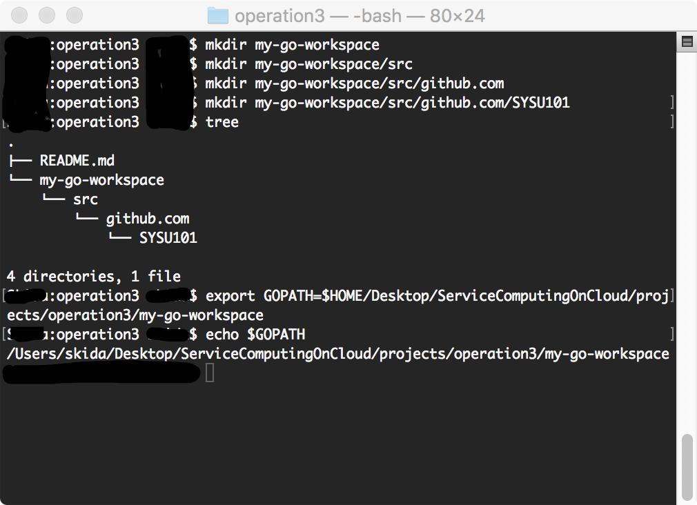
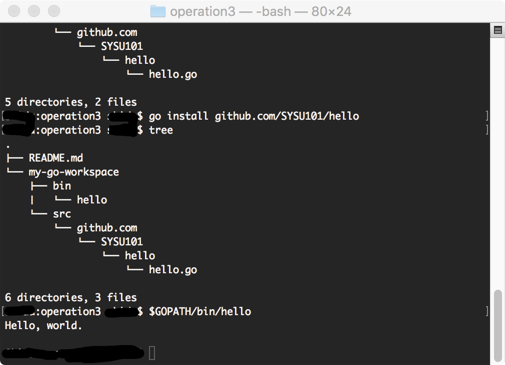
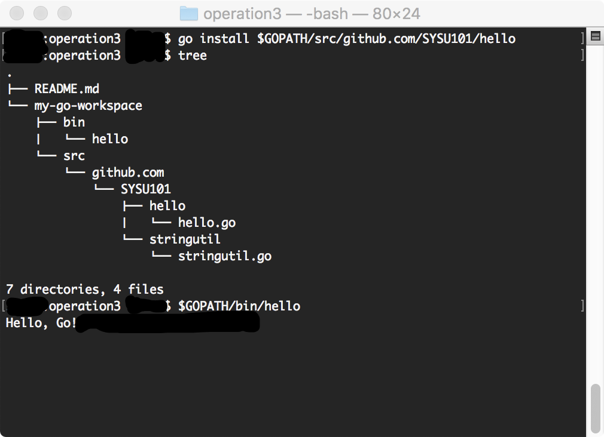

## 实验三：按官方文档[如何使用Go编程](https://go-zh.org/doc/code.html)写第一个包，做第一次测试。  
*17343101 苏祺达*  
<br />

### 实验准备  
---
#### 创建工作空间，配置环境变量  
&emsp;&emsp;在命令行输入如下指令，创建工作环境  
```shell
mkdir my-go-workspace
mkdir my-go-workspace/src
mkdir my-go-workspace/src/github.com
mkdir my-go-workspace/src/github.com/SYSU101
# 由于 pkg 和 bin 文件夹会由 go 工具自行创建，因此先不用管这两个文件夹
```
&emsp;&emsp;运行结果：  
  
&emsp;&emsp;然后执行`export GOPATH=$HOME/Desktop/ServiceComputingOnCloud/projects/operation3/my-go-workspace`以创建`GOPATH`环境变量。  
&emsp;&emsp;运行结果：  
  
&emsp;&emsp;**这里使用绝对路径太长了，用相对路径可不可以？从笔者为数不多的Go使用经历来看，不可以，会在之后构建包时报错，理由是`GOPATH`不能为相对路径。**  
<br />

#### 创建并安装第一个包
&emsp;&emsp;在`$GOPATH/src/github.com/SYSU101`下，创建一个名为`hello`的文件夹，并在该文件下再创建一个名为`hello.go`的文件，在`hello.go`里，写入以下代码：  
```golang
package main

import "fmt"

func main() {
    fmt.Println("Hello, world.\n")
}
```
&emsp;&emsp;然后使用`go install github.com/user/hello`命令安装此包，就可以执行`$GOPATH/bin/hello`运行生成的包啦！  
&emsp;&emsp;运行结果：  
  
<br />

#### 创建第一个包并调用它  
&emsp;&emsp;创建`$GOPATH/src/github.com/SYSU101/stringutil`文件夹，并在该文件下面创建`stringutil.go`文件，在文件中写入如下代码：  
```golang
// stringutil 包含有用于处理字符串的工具函数。
package stringutil

// Reverse 将其实参字符串以符文为单位左右反转。
func Reverse(s string) string {
	r := []rune(s)
	for i, j := 0, len(r)-1; i < len(r)/2; i, j = i+1, j-1 {
		r[i], r[j] = r[j], r[i]
	}
	return string(r)
}
```
&emsp;&emsp;修改`$GOPATH/src/github.com/SYSU101/hello/hello.go`文件，将文件内容修改为：  
```golang
package main

import (
	"fmt"
	"github.com/user/stringutil"
)

func main() {
	fmt.Printf(stringutil.Reverse("!oG ,olleH"))
}
```
&emsp;&emsp;执行`go install github.com/user/hello`命令，构建`hello`命令，然后执行`$GOPATH/bin/hello`，就可以看到：  
  
<br />

#### 测试
&emsp;&emsp;在`$GOPATH/src/github.com/SYSU101/stringutil`文件夹下创建`stringutil_test.go`文件，在文件中写入如下代码：  
``` golang
package stringutil

import "testing"

func TestReverse(t *testing.T) {
	cases := []struct {
		in, want string
	}{
		{"Hello, world", "dlrow ,olleH"},
		{"Hello, 世界", "界世 ,olleH"},
		{"", ""},
	}
	for _, c := range cases {
		got := Reverse(c.in)
		if got != c.want {
			t.Errorf("Reverse(%q) == %q, want %q", c.in, got, c.want)
		}
	}
}
```
&emsp;&emsp;接着使用`go test github.com/SYSU101/stringutil`运行该测试：  
  