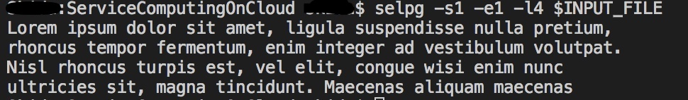
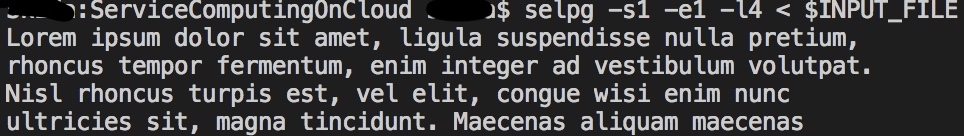
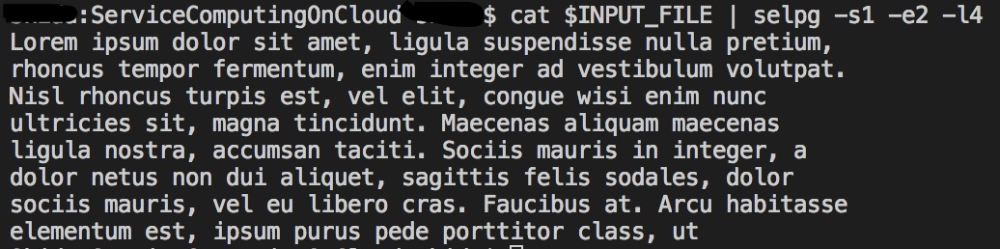
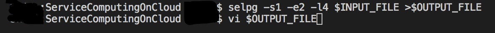
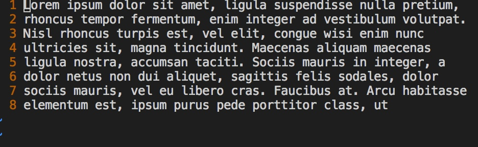

## 实验四：使用 golang 开发 [开发 Linux 命令行实用程序](https://pmlpml.github.io/ServiceComputingOnCloud/ex-cli-basic) 中的 selpg  
*17343101 苏祺达*  
<br />

### 一些额外说明 
---
#### 关于源代码存放位置
由于对课程作业目录进行了一次重新组织，将[../../projects/](https://github.com/SYSU101/ServiceComputingOnCloud/tree/master/projects)文件夹改为 Go 工作空间，仅存放代码而不存放报告，因此本次实验源代码请戳[这里](https://github.com/SYSU101/ServiceComputingOnCloud/tree/master/projects/src/github.com/SYSU101/selpg)，带来的改作业上的不便，敬请谅解。
#### 关于测试
由于原 selpg 项目中测试时使用的默认将每72行视为一页的做法会带来对测试结果展示上的不便，因此**将部分测试命令加上`-l4`选项，即将每4行视为一页**。要对该选项的默认值进行测试，请下载源代码到本地上进行测试。  
    
测试时使用的测试文件放在[../../testdatas/operation4/](https://github.com/SYSU101/ServiceComputingOnCloud/tree/master/testdatas/operation4)下，测试命令中与之相关的路径部分将会使用环境变量代替。

### 测试
---
1. 
    测试命令： 
    > selpg -s1 -e1 -l4 \$INPUT_FILE  

    测试描述：
    > 该命令将把“\$INPUT_FILE”的第 1 页写至标准输出（也就是屏幕），因为这里有 重 定向或管道。

    测试结果：
    
1. 
    测试命令：
    > selpg -s1 -e1 -l4 < \$INPUT_FILE

    测试描述：
    > 该命令与测试 1 所做的工作相同，但在本测试中，selpg 读取标准输入，而标准输入已被 shell／内核重定向为来自“input_file”而不是显式命名的文件名参数。输入的第 1 页被写至屏幕。

    测试结果：
    
1. 
    测试命令：
    > cat \$INPUT_FILE \| selpg -s1 -e2 -l4

    测试描述：
    > “cat \$INPUT_FILE”的标准输出被 shell／内核重定向至 selpg 的标准输入。将第 1 页到第 2 页写至 selpg 的标准输出（屏幕）。

    测试结果：
    

1. 
    测试命令：
    > selpg -s1 -e2 -l4 \$INPUT_FILE >\$OUTPUT_FILE

    测试描述：
    > selpg 将第 1 页到第 2 页写至标准输出；标准输出被 shell／内核重定向至“\$OUTPUT_FILE”。

    测试结果：
    
    
  ……（后面太长不想测）

### 程序逻辑
---
#### 输入参数解析
貌似没有在`flag`或者`pflag`里头找到模式匹配参数的用法？于是自己造轮子。
首先规定一个参数匹配器结构，使用 Pattern 检查参数流第一个参数，如果匹配则使用 Next 消耗参数流并执行附加操作。使用指针是否为 nil 判断该参数是否输入。
```go
type flagMatcher struct {
	Pattern string
	Next    func(*[]string) error
	Usage   string
}

var startPageN, endPageN, linesPerPage *int
var formFeed, showHelpMsg *bool
var toDestination, filename *string
```
使用默认的校验器消耗所有未匹配的参数，将这些参数视为输入文件名：
```go
&flagMatcher{
	Pattern: ".*",
	Next: func(flagstream *[]string) error {
		filename = &(*flagstream)[0]
		*flagstream = (*flagstream)[1:]
		return nil
	},
	Usage: "[filename]\tSpecify the input file",
},
```
丢弃第一个参数，因为第一个参数是程序名：
```go
args := os.Args[1:]
if err := parseFlags(&args); err != nil {
	os.Stderr.Write([]byte(err.Error() + "\n"))
	return
}
```
不断地检查并使用参数，直至参数流被消耗完毕：
```go
for len(*flagstream) > 0 {
	for _, matcher := range matchers {
		if matched, err := regexp.MatchString(matcher.Pattern, (*flagstream)[0]); err == nil && matched {
			if err = matcher.Next(flagstream); err != nil {
				return err
			} else {
				break
			}
		}
	}
}
```
最后对输入的参数进行合法性检查，检查是否有互斥的参数设置，是否有必选的参数缺省，并对有默认值的参数进行补全。若使用`-h`参数显示帮助信息，则跳过参数检查，因为其余参数将不会被用到。
```go
initValidatiors()
for _, validator := range validators {
	if validator.Condition {
		return errors.New(validator.ErrorMsg)
	}
}
if formFeed == nil && linesPerPage == nil {
	temp1 := 72
	linesPerPage = &temp1
	temp2 := false
	formFeed = &temp2
}
if showHelpMsg == nil {
	temp := false
	showHelpMsg = &temp
}
```
#### 根据参数判断输入输出的接口
如果参数的文件名不为空，则打开对应的文件，否则使用`os.Stdin`作为输入的reader。
如果`-d`参数已经设置，则创建子进程，并且获得其`StdinPipe`，否则使用`os.Stdout`作为输出的writer。
```go
if filename != nil {
	if input, err = os.Open(*filename); err != nil {
		return err
	}
} else {
	input = os.Stdin
}
if toDestination != nil {
	if output, err = exec.Command("lp", "-d"+*toDestination).StdinPipe(); err != nil {
		return err
	}
} else {
	output = os.Stdout
}
```
#### 读入reader中的内容和输出到writer
使用一个缓冲结构缓冲输入和输出的内容：
```go
type byteBuf struct {
	byteBuf []byte
	ptr     int
	size    int
}
```
每次读取字符前，判断输入缓冲是否为空，如果为空，则从输入reader中读取和缓冲区相同大小的字节数。程序结束前，判断输出缓冲是否不为空，如果不为空，则依据情况将输出缓冲的内容清空或者输出到输出writer中。
```go
func readUntil(delimiter byte, shouldWrite bool) error {
	for {
		if readBuf.IsEmpty() && !readBuf.Read(input) {
			break
		}
		nextByte := readBuf.ReadNextByte()
		if nextByte == delimiter {
			break
		}
		writeBuf.WriteNextByte(nextByte)
		if writeBuf.IsFull() {
			if shouldWrite {
				if err := writeBuf.Write(output); err != nil {
					return err
				}
			} else {
				writeBuf.Clear()
			}
		}
	}
	if !writeBuf.IsEmpty() {
		if shouldWrite {
			if err := writeBuf.Write(output); err != nil {
				return err
			}
		} else {
			writeBuf.Clear()
		}
	}
	return nil
}
```