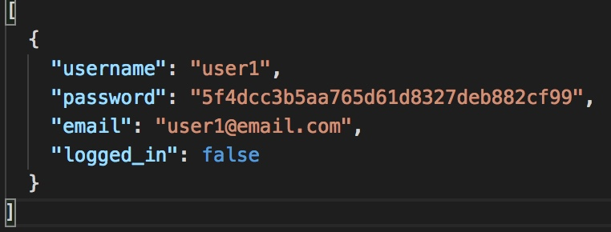
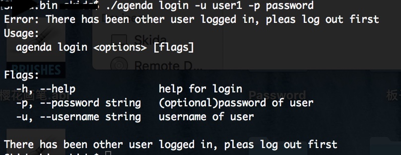

## 实验七：CLI 命令行实用程序开发实战 - Agenda
*17343101 苏祺达*  
 

### 一些额外说明 
---
#### 关于源代码存放位置
由于对课程作业目录进行了一次重新组织，将[../../projects/](https://github.com/SYSU101/ServiceComputingOnCloud/tree/master/projects)文件夹改为 Go 工作空间，仅存放代码而不存放报告，因此本次实验源代码请戳[这里](https://github.com/SYSU101/ServiceComputingOnCloud/tree/master/projects/src/github.com/SYSU101/agenda)，带来的改作业上的不便，敬请谅解。

### 运行结果
---

#### 帮助信息
在命令行中输入`./agenda help`得到如下输出：

#### 注册
在命令行中输入`./agenda register -u user1 -p password -e user1@email.com`，打开相同目录下的`user.json`，可以看到：

其中`password`进行了md5加密，`logged_in`字段表示该用户是否已登录。

#### 登录
在命令行中输入`./agenda login -u user1 -p password`，打开相同目录下的`user.json`，可以看到：

可以看到`loggin_in`字段变为`true`，此时如果再次尝试登录的话，会得到如下结果：

#### 日志功能
打开相同目录下的`2019-10-28.log`（文件名为当天日期），可以看到：

